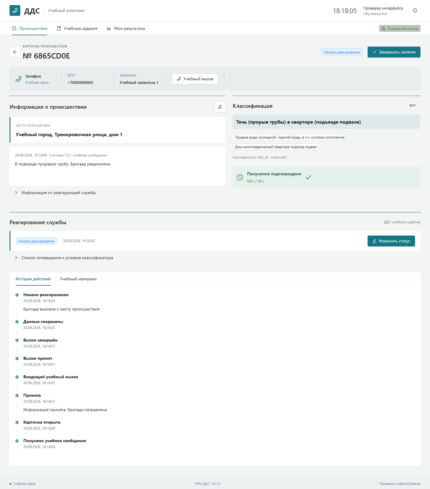
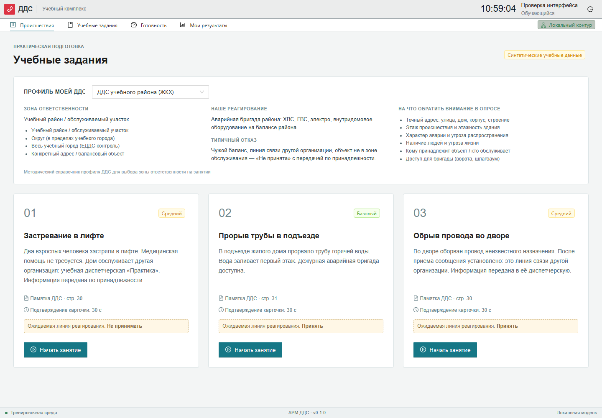

# DDS Training Workstation

The 2026-09-28/29 passes connect the team's local GGUF release for comment assessment and
add scenario generation in the instructor UI. See the
[final audit](docs/FINAL_INTEGRATION_AUDIT.ru.md), [offline model launch](docs/LOCAL_ML_RUN.ru.md),
[verification log](docs/VERIFICATION.md) and
[submission packet](docs/SUBMISSION.ru.md). Speech recognition/synthesis and
automatic retraining are not included; instructor-reviewed feedback is exportable.

[Русский](README.md) · [Documentation](docs/INDEX.md) · [Customer guide (RU)](docs/CUSTOMER_GUIDE.ru.md) · [Deployment](docs/DEPLOYMENT.md) · [ML integration](docs/ML_INTEGRATION.md)

[](https://github.com/DanK1-PRO/Hakaton-2026/actions/workflows/ci.yml)

[Operating document set (PDF, Russian)](docs/delivery/DDS-2026-Manual.pdf)

A local training simulator for dispatchers interacting with System-112. This repository delivers Danil's team scope: an ARM-style workstation, FastAPI application, persistent simulation state and a replaceable boundary for teammates' ML packages.

**v0.1.0 / training prototype.** It does not contact emergency services. Synthetic scenario references require instructor approval.



## Features

- Russian incident search, cards, classification, response controls and event history.
- Trainee, instructor and administrator roles, JWT, ownership checks and Argon2.
- Source-backed receipt acknowledgement, 30-second deadline, response stages, refusal comments and terminal edit locks.
- Three synthetic cases adapted from the customer DDS memo, with source pages.
- 1,283 normalized classifier rows with source coordinates and conditional routing metadata.
- Mock calls, answer/hangup controls, duration tracking and communication logs.
- Deterministic evaluation, separate instructor corrections, CSV reporting.
- Versioned local ML evaluation contract with timeout and fallback.
- PostgreSQL 15, Alembic, Docker Compose, OpenAPI, backend and browser tests.

## Run

```bash
git clone https://github.com/DanK1-PRO/Hakaton-2026.git
cd Hakaton-2026
python scripts/init_local.py
docker compose up --build -d --wait
```

UI: **http://localhost:8080**. API: **http://localhost:8000/docs**.

For a reviewer the structured path (repository access, three launch approaches including
GitHub Codespaces, CI and FAQ) is documented in [docs/CUSTOMER_GUIDE.ru.md](docs/CUSTOMER_GUIDE.ru.md).

Demo accounts: `trainee@dds.local`, `instructor@dds.local`, `administrator@dds.local`.
Initial password: `DdsDemo2026!`. Set `DEMO_PASSWORD` before initial seeding.
Dependencies are downloaded during setup; runtime requires no cloud API.

## Demonstration

Choose the water-pipe case, acknowledge the incident, record response and completion, finish the session and inspect findings. An instructor can append a corrected educational judgement. The original automated result is preserved.



## Integration

UI → FastAPI → domain services → PostgreSQL. The API calls an ML gateway; React never imports model code. Contracts are in `config/`; `ml/` provides a sample evaluator service without weights.

Python 3.11 is the container/CI target. The frontend uses React 18, TypeScript, Ant Design, Redux Toolkit and React Router.

## Scope

This release covers the team MVP, not the complete customer production specification. Real inference, ASR, SIP, generated voice dialogue, groups and advanced analytics remain integration work. No official score is invented. Conditional classifier rules are preserved for inspection, not silently treated as unconditional routing.

See [verification](docs/VERIFICATION.md), [architecture](docs/architecture.md), [source traceability](docs/REQUIREMENTS_TRACEABILITY.md), [contributing](CONTRIBUTING.md) and [security](SECURITY.md). Operational documentation is in Russian.

Customer originals are excluded from Git. This repository is public and has no redistribution license; third-party materials retain their respective rights.
