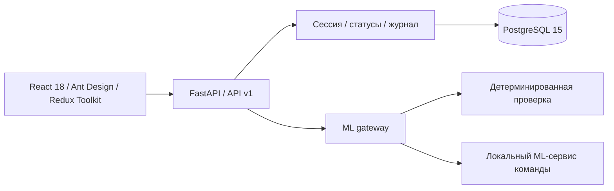

> **УВЕДОМЛЕНИЕ ОБ ИНТЕЛЛЕКТУАЛЬНОЙ СОБСТВЕННОСТИ · ДЛЯ КОМПАНИЙ И ОРГАНИЗАТОРОВ ХАКАТОНА**
>
> Правообладатель: **Даниил (DanK1-PRO)**, © 2026. Все права защищены.
> Проект распространяется под [GNU GPL v3](LICENSE): это право читать, запускать, изучать и
> изменять код **строго на условиях лицензии**, а не безусловное разрешение на использование.
>
> Без письменного коммерческого соглашения с правообладателем **запрещено**:
>
> - закрытая интеграция кода в сторонние продукты, распространяемые без открытия исходного
>   кода (GPLv3, разд. 5) — такая интеграция возможна только по отдельному соглашению;
> - удаление, изменение или сокрытие уведомлений об авторстве, присвоение авторства и
>   выдача проекта за собственную разработку (GPLv3, разд. 4, 5, 7);
> - распространение изменённых версий под другой лицензией и перепродажа копий без
>   выполнения условий GPLv3 — сохранения исходного кода, уведомлений и самой лицензии
>   (GPLv3, разд. 4, 5, 8).
>
> GPLv3 допускает коммерческое распространение только вместе с открытым исходным кодом
> производной версии и сохранёнными уведомлениями об авторстве; это не равнозначно разрешению
> на закрытую коммерческую эксплуатацию. Начало коммерческой, закрытой или брендированной
> интеграции — исключительно после официального соглашения с правообладателем.
> Проект — учебный прототип хакатона «Лидеры цифровой трансформации» (ЛЦТ 2026);
> оригиналы материалов заказчика в Git не входят и остаются за своими правообладателями.

# ДДС · Учебный комплекс

Проходы 28–29.09: [интеграционный аудит и границы готовности](docs/FINAL_INTEGRATION_AUDIT.ru.md),
[запуск реальной локальной модели](docs/LOCAL_ML_RUN.ru.md), [протокол проверки 29.09](docs/VERIFICATION.md), [комплект сдачи](docs/SUBMISSION.ru.md).

[English](README.en.md) · [Документация](docs/INDEX.md) · [Для заказчика](docs/CUSTOMER_GUIDE.ru.md) · [Запуск](docs/DEPLOYMENT.md) · [Чеклист сдачи](docs/FINAL_DELIVERY_CHECKLIST.ru.md) · [Интеграция ML](docs/ML_INTEGRATION.md) · [Демонстрация](docs/DEMO.md)

[](https://github.com/DanK1-PRO/Hakaton-2026/actions/workflows/ci.yml)

[Эксплуатационный комплект PDF](docs/delivery/DDS-2026-Manual.pdf) · [Статус и ограничения](docs/CURRENT_STATUS.md)

Локальный тренажёр диспетчера дежурно-диспетчерской службы, взаимодействующей с системой-112. Реализует программу-минимум Даниила: интерфейс АРМ, FastAPI, хранение учебных действий, первичную проверку и подключение моделей команды через версионированные контракты.

**v0.1.0 · Учебный прототип.** Реальные вызовы экстренных служб не выполняются. Эталоны демонстрационных заданий требуют методического подтверждения преподавателем.


## Возможности

- Русский интерфейс: поиск и фильтрация происшествий, карточка, классификация, панель реагирования, история.
- Паспорт готовности контура для показа заказчику: локальность, ML, карта, данные, документы и проверки.
- Обучающийся, преподаватель, администратор: JWT, проверка владельца карточки, Argon2.
- Получение карточки, подтверждение за 30 секунд, этапы реагирования, отказ с комментарием, закрытие редактирования.
- Три синтетических занятия по примерам памятки ДДС: прорыв трубы, застревание в лифте, обрыв провода.
- Общий классификатор: 1 283 строки v046_24 с кодами, признаками, условиями оповещения и происхождением.
- Учебный телефон: входящий вызов, ответ, завершение, время разговора и журнал.
- Проверка полей, действий и времени; заключение преподавателя; отчёт CSV.
- Локальный ML-адаптер с тайм-аутом и резервной детерминированной проверкой.
- PostgreSQL 15, Alembic, Docker Compose, OpenAPI, серверные и браузерные тесты.
- Генерация учебных сценариев в интерфейсе преподавателя: выбор типа и сложности →
  предпросмотр вариантов локальной модели → импорт одобренных с авторством проверившего
  (тот же путь доступен через CLI).
- Публичный репозиторий: запуск на своей машине (Docker/Windows) или в GitHub Codespaces
  без установки; CI на каждый push — линтер, тесты, сборка и браузерные сценарии.

## Быстрый запуск

Нужны Docker с Compose и Python для генерации конфигурации.

```bash
git clone https://github.com/DanK1-PRO/Hakaton-2026.git
cd Hakaton-2026
python scripts/init_local.py
docker compose up --build -d --wait
```

Интерфейс: **http://localhost:8080**. API: **http://localhost:8000/docs**.
Запуск без Docker на Windows описан в [инструкции](docs/DEPLOYMENT.md).

Проверяющему: [инструкция для заказчика](docs/CUSTOMER_GUIDE.ru.md) — доступ, три подхода
запуска, CI и частые вопросы. Без локальной установки: [открыть в GitHub Codespaces](https://codespaces.new/DanK1-PRO/Hakaton-2026)
(нужен только аккаунт GitHub; лимиты бесплатного тарифа описаны в инструкции).

### Локальный запуск через виртуальное окружение

Для проверки без Docker используйте `.venv`; само окружение не коммитится, но создаётся на машине проверяющего:

```powershell
py -3.11 -m venv .venv
.\.venv\Scripts\python.exe -m pip install -r backend\requirements.txt
.\.venv\Scripts\python.exe scripts\init_local.py
powershell -ExecutionPolicy Bypass -File scripts\windows\start-app.ps1
```

Для ML-оценщика дополнительно:

```powershell
.\.venv\Scripts\python.exe -m pip install -r ml\requirements.txt
$env:PYTHONPATH='backend'
.\.venv\Scripts\python.exe -m uvicorn ml.evaluator_service:app --host 127.0.0.1 --port 8090
```

| Роль | Почта | Начальный пароль |
|---|---|---|
| Обучающийся | trainee@dds.local | DdsDemo2026! |
| Преподаватель | instructor@dds.local | DdsDemo2026! |
| Администратор | administrator@dds.local | DdsDemo2026! |

Пароль задаётся через `DEMO_PASSWORD` перед первым заполнением БД. Перед доступом из учебной сети настройте отдельные пароли и TLS.

## Учебный цикл

1. Войти как обучающийся, открыть «Учебные задания».
2. Начать «Прорыв трубы в подъезде».
3. В карточке выбрать «Изменить статус» → «Принята».
4. Отразить начало реагирования и результаты работ.
5. Выбрать «Работы завершены», затем «Завершить занятие».
6. Изучить результат; преподаватель открывает «Контроль занятий» и сохраняет заключение.

## Архитектура



React работает только с API. Доменные правила не зависят от нейросети. Исходные материалы заказчика остаются локально.

| Каталог | Назначение |
|---|---|
| `backend/` | API, правила, модели, миграции, pytest |
| `frontend/` | React/TypeScript, Playwright |
| `config/` | OpenAPI и JSON Schema |
| `data_derived/` | Классификатор и учебные сценарии |
| `docs/` | Архитектура, руководства, приёмка, показы |
| `ml/` | Пример сервиса и контракт подключения |
| `scripts/` | Подготовка данных, запуск, проверка |
| `.agents/skills/` | Проектные skills |

## Проверка

```bash
pip install -r backend/requirements.txt
pytest -q
ruff check backend
cd frontend
npm ci
npm run build
npx playwright install chromium
npm test
```

Браузерные тесты требуют запущенные API, UI и заполненную БД. Выполненные проверки: [протокол](docs/VERIFICATION.md).

## Границы версии

Это часть командного MVP, а не вся итоговая система большого ТЗ. Реальные ML-веса, ASR, двусторонний голосовой диалог, SIP, группы обучения и расширенная аналитика относятся к дальнейшим интеграциям. Балльная методика не утверждена: система показывает замечания и время без выдуманного официального балла. Условные маршруты классификатора доступны как справочные правила.

Документация организована с учётом состава документации АС; официальное подтверждение соответствия ГОСТ не заявляется. См. [ведомость](docs/DOCUMENT_REGISTER.md) и [открытые вопросы](docs/OPEN_QUESTIONS.md).

[Участие в разработке](CONTRIBUTING.md) · [Безопасность](SECURITY.md) · [Изменения](CHANGELOG.md)

## Лицензия и авторские права

Репозиторий публичный: https://github.com/DanK1-PRO/Hakaton-2026 открывается по ссылке без
инвайта. Код распространяется под [GNU General Public License v3.0](LICENSE)
(SPDX `GPL-3.0-only`), © 2026 Даниил (DanK1-PRO).

Файл `LICENSE` содержит незредактированный текст GPLv3 — FSF запрещает менять текст
самой лицензии, поэтому уведомление о правах зафиксировано здесь, в начале README, и в шапках
исходных файлов (см. ниже). Благодаря этому GitHub определяет репозиторий как `GPL-3.0`.

GPLv3 даёт право запускать, изучать, изменять и распространять код, но обязывает сохранять
уведомления об авторстве и выпускать производные продукты с открытым исходным кодом на
условиях GPLv3. Коммерческая, закрытая или брендированная интеграция — только по отдельному
соглашению с правообладателем (см. уведомление в начале файла). Права на исходные документы
заказчика сохраняются за их правообладателями.

### Шапка файла с кодом

Каждый новый исходный файл начинается со SPDX-идентификатора и уведомления об авторстве:

```python
# SPDX-License-Identifier: GPL-3.0-only
# Copyright (C) 2026 Даниил (DanK1-PRO)
```

```ts
// SPDX-License-Identifier: GPL-3.0-only
// Copyright (C) 2026 Даниил (DanK1-PRO)
```

```cpp
// SPDX-License-Identifier: GPL-3.0-only
// Copyright (C) 2026 Даниил (DanK1-PRO)
```

Правила оформления: шапка ставится в первом же коммите файла; для YAML, Markdown и HTML
используйте `#`, `#` и `<!-- -->` соответственно; при копировании кода из репозитория обе
строки сохраняются; уведомления в существующих файлах не удаляются и не переименовываются
(GPLv3, разд. 4, 5). Достаточно добавлять шапку в новые файлы — полная переустановка
шапок по всему архиву не требуется.
