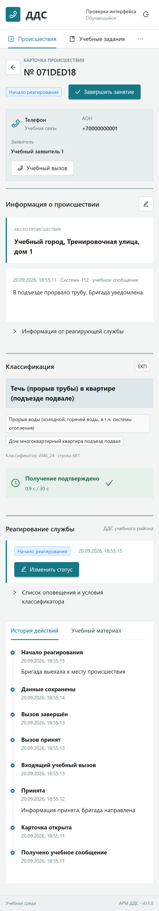
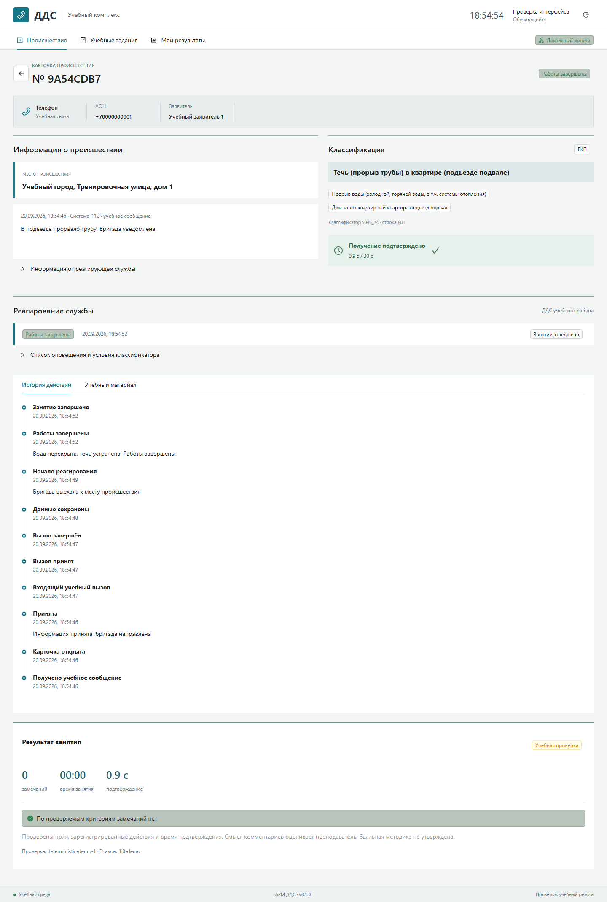
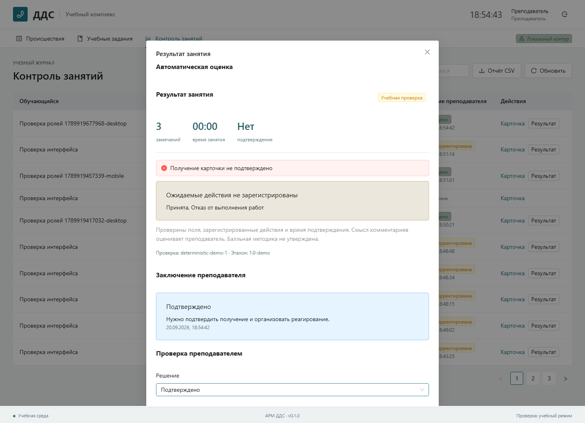
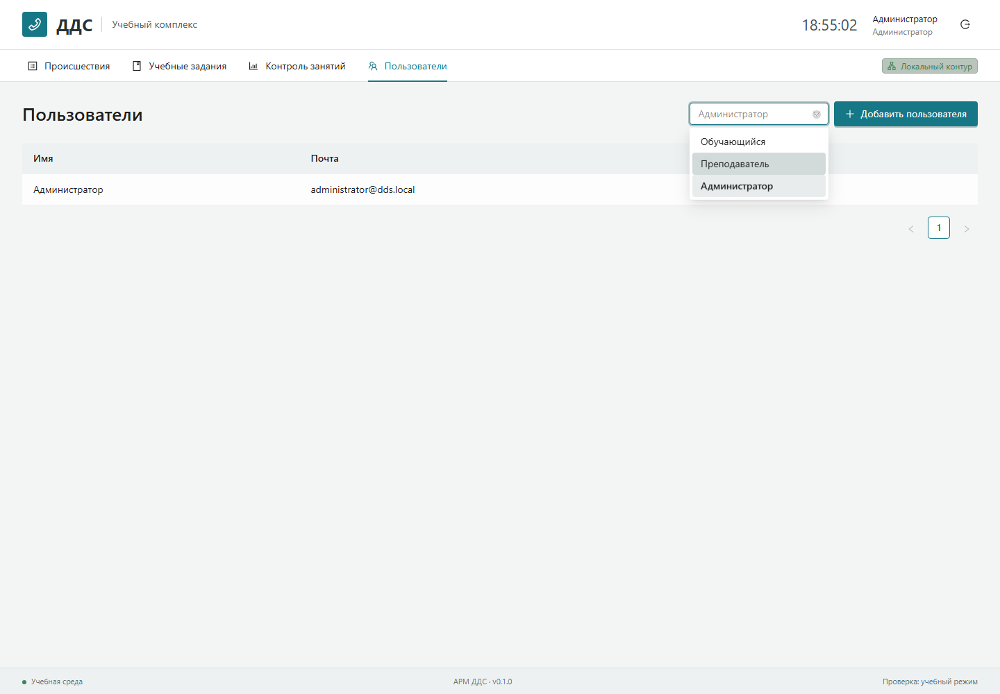

# Демонстрация

## Показ 1 · Учебный цикл, 3 минуты

Войти как trainee. Открыть «Учебные задания» → «Прорыв трубы». Принять карточку за 30 секунд. Открыть информацию от службы, отметить начало реагирования, результаты работ и завершение. Завершить занятие. Показать историю и проверку.

## Показ 2 · Ошибка и разбор, 2 минуты

Начать «Застревание в лифте». Попытаться сохранить «Не принята» без комментария. Добавить причину и факт передачи в обслуживающую организацию. Завершить. Войти как instructor, открыть результат, сохранить уточнение и выгрузить CSV.

## Показ 3 · ML-интеграция, 2 минуты

Запустить локальный пример из ML_INTEGRATION.md. Переключить ML_MODE=local и перезапустить API. Завершить занятие, показать версию провайдера. Остановить ML-сервис и повторить: результат помечается как резервный, основная система продолжает работу.

## Маршрут показа по экранам (рекомендуемый порядок)

1. **Вход** — роль обучающегося, `trainee@dds.local`.
2. **Поиск происшествий** (`/incidents`) — показать поиск, фильтры по статусу и типу,
   активные фильтры в виде тегов и кнопку «Сбросить»; открыть карточку из списка.
3. **Учебные задания** (`/training`) — три сценария, старт «Прорыв трубы в подъезде».
4. **Карточка ДДС** (`/incidents/:id`) — «Получена службой» → «Принята», реакция,
   статусы «Начало реагирования» → «Работы завершены», завершение занятия.
5. **Мои результаты** (`/results`) — автоматическая оценка и время.
6. **Контроль занятий** — вход преподавателем `instructor@dds.local`, просмотр
   «Заключения преподавателя» в таблице, модалка с разделением «Автоматическая оценка»
   и «Проверка преподавателем», сохранение заключения, выгрузка CSV.
7. **Пользователи** — вход администратором `administrator@dds.local`, фильтр по роли,
   создание пользователя: подтверждение пароля, индикатор сложности и «Сгенерировать пароль».

## Показы интерфейса

Снимки создаются браузерным тестом на реальном API. Все данные учебные. Полноценный голосовой диалог и обученные модели в текущий показ не входят.
